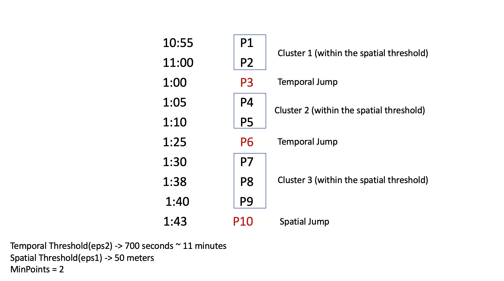

Spatio-temporal algorithm implemented using Python.

##  Working of the algorithm

Algorithm is quite similar to the usual DBSCAN algorithm, with an addition to incorporate the temporal information, if any.

There are primarily 3 parameters in this implementation - 

* eps1/spatial threshold - This is similar to epsilon in DBSCAN
* eps2/temporal threshold
* min_neighbors - This is similar to MinPts in DBSCAN.

If the time difference between successive points is within eps2 AND the distance between successive points is less than eps1, they belong to same cluster.

There are no defined rules for choosing the values of these parameters, selection of these depend entirely on specific application and use-case.

**Notice I have used AND in above statement, i.e. both conditions must be followed, for points to belong to the same cluster.**

An intuitive explanation can be understood by the image below - 




If you need some more clariications, here are some [slides](http://www.bios.unc.edu/~dzeng/BIOS740/Qin_Bios740.pdf) by Department of Statistics and Operations Research, The University of North Carolina

## An Important Note before usage - 
If you are using this for GPS data, ensure that you convert the CRS of latitude, longitude to UTM.(you can use this [library](https://pypi.org/project/utm/) to do that), that is because this algorithm needs to calculate multiple distances between points, it optimizes by assuming latitude and longitude columns in UTM projection(since Euclidean distance is simpler and faster to calculate than haversine).

## Usage

```python
import st_dbscan
st_dbscan = st_dbscan.STDBSCAN(spatial_threshold=50, temporal_threshold=700,
                         min_neighbors=2)
st_dbscan.fit_transform(data,col_lat='latitude',col_lon='longitude',col_time='ts')
```
* As mentioned, above assumes your latitude and longitude are in UTM Projection.
* Invoking .fit_transform() returns a Pandas Series with cluster labels


For detailed explanation, you can refer the following paper - 
```
Birant, D. and Kut, A. (2007). St-dbscan: An algorithm for clustering 
spatial–temporal data. Data & Knowledge Engineering, 60(1):208 – 221. 
Intelligent Data Mining.
```